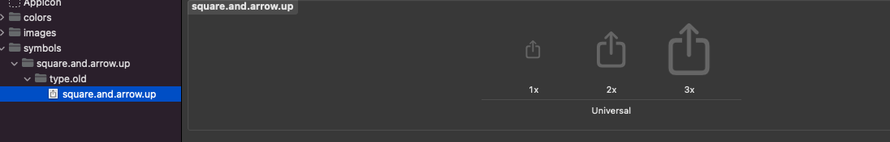
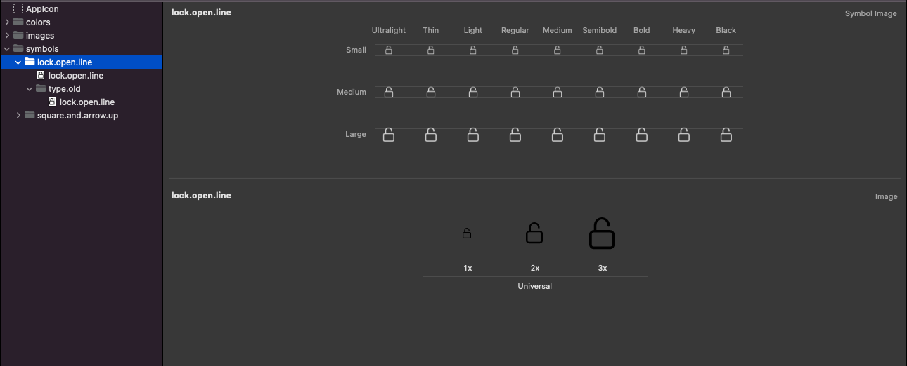

[](https://cocoapods.org/pods/AppSymbol)
[](https://cocoapods.org/pods/AppSymbol)
[](https://cocoapods.org/pods/AppSymbol)

Use the *SFSymbol* in your ios 13 below deployment target projects without any version check.
<br>

## Why App Symbol?
SFSymbol is only available above the iOS 13, So we have to check the iOS version every time when we using the SFSymbol below iOS 13 deployment target projects. We can get rid of this boilerplate code using the AppSymbol framework.

<br>

## Installation

### CocoaPods
[CocoaPods](https://cocoapods.org) is a dependency manager for Cocoa projects. You can install it with the following command:

```ruby
$ gem install cocoapods
```
To integrate AppSymbol into your Xcode project using CocoaPods, specify it in your Podfile:

```ruby
source 'https://github.com/CocoaPods/Specs.git'
platform :ios, '12.0'
use_frameworks!

target '<Your Target Name>' do
    pod 'AppSymbol', '~> 1.0.0'
end
```
Then, run the following command:
```ruby
$ pod install
```

### Swift Package Manager

[Swift Package Manager](https://swift.org/package-manager/) is a tool for managing the distribution of Swift code. It’s integrated with the Swift build system to automate the process of downloading, compiling, and linking dependencies.

> Xcode 11+ is required to build AppSymbol using Swift Package Manager.

```Swift
dependencies: [
    .package(url: "https://github.com/MnkGitBox/AppSymbol.git", .upToNextMajor(from: "1.0.0"))
]
```

### Manually

If you prefer not to use either of the aforementioned dependency managers, you can integrate AppSymbol into your project manually.

---

## Usage

- **SFSymbol**
    
    1. Add symbol image files to assert folder with original SFSymbol name for older iOS versions.

    <br>

    

    2. Extend the `AppSymbolNames` to add type `AppSymbolNameType` variable with any name. And add variable value as original SFSymbol name. 

    <br>

    ```Swift
    extension AppSymbolNames {

        var squareAndArrowUp: AppSymbolNameType { .init(rawValue: "square.and.arrow.up") }

    }
    ```

    3. Finally, you can use this symbol file using the function provided by the framework.

    ```Swift
    let shareButton = UIButton.init(with: .squareAndArrowUp, to: .systemFont(ofSize: 17, weight: .medium), for: .normal, scale: .medium)

    let shareImageView = UIImageView.init(.squareAndArrowUp, .systemFont(ofSize: 15, weight: .medium), scale: .medium)
    ```

    4. Result
        - iOS 15.2 device

         

        - iOS 12.0 device

        

- **Custom Symbol**

    1. Even though Apple has provided thousands of different symbols in the SF Symbol library, it’s impossible to cover every conceivable image you may need in your app. What Apple has done instead is make it really easy for you to build your own custom symbols, when needed. (*You can find how to create custom symbol using the symbol template [here](https://developer.apple.com/documentation/uikit/uiimage/creating_custom_symbol_images_for_your_app).*)

    <br>

    

    2. Extend the `AppSymbolNames` to add type `AppSymbolNameType` variable with any name. And add variable value as original SFSymbol name. 

    <br>

    ```Swift
    extension AppSymbolNames {  
        ...

        static var lockOpenLine: AppSymbolNameType { .init(rawValue: "lock.open.line") }

    }
    ```

    3. Finally, you can use this symbol file using the function provided by the framework.

    ```Swift
    let shareButton = UIButton.init(with: .lockOpenLine, to: .systemFont(ofSize: 17, weight: .medium), for: .normal, scale: .medium)

    let shareImageView = UIImageView.init(.lockOpenLine, .systemFont(ofSize: 15, weight: .medium), scale: .medium)
    ```
    4. Result
        - iOS 15.2 device

         

        - iOS 12.0 device

        

## Resources

You can find the original sample code [here](SampleCode.swift).

## Credits
- Malith Nadeeshan ([malithnadeeshan](https://twitter.com/malithnadeeshan))

## License

AppSymbol is released under the MIT license. See LICENSE for details.

---
